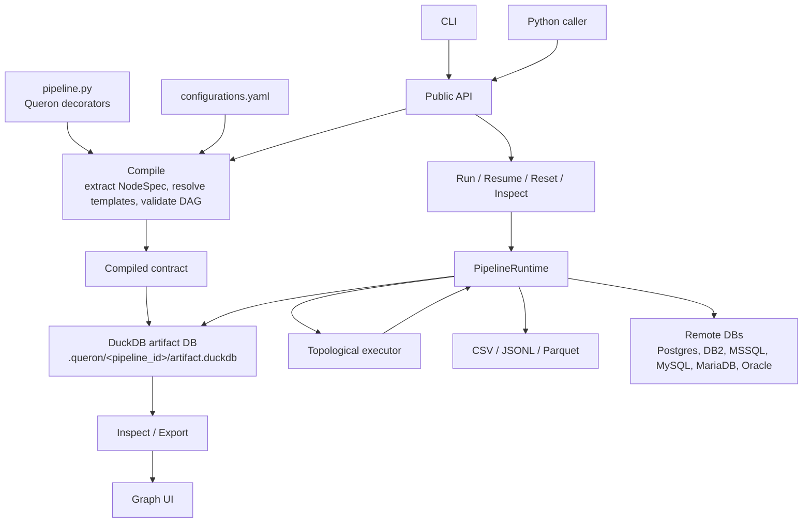

# Architecture

Queron is a Python-declared data pipeline runner. Users write `pipeline.py` files with `queron` decorators. Queron compiles those decorators into a DAG contract, stores metadata in DuckDB, and executes each node in dependency order.

For the deeper operational walkthrough, see [Internals Guide](internals-guide.md).

## High-Level Diagram



## Main Layers

| Layer | Files | Responsibility |
|---|---|---|
| Public DSL | `queron/__init__.py` | User-facing decorators and SQL template helpers. |
| Public API | `queron/api.py` | Compile, run, resume, reset, stop, inspect, and export operations. |
| CLI | `queron/cli.py` | `queron` command line entry point. |
| Compiler | `queron/compiler.py` | Loads pipeline code, extracts node metadata, resolves refs/sources/lookups, validates DAG, and builds the active contract. |
| Runtime | `queron/runtime.py` | Executes node kinds, manages DuckDB connection, run records, logs, stop requests, warnings, and connector calls. |
| Executor | `queron/executor.py` | Topological ordering, selected-node execution, failure handling, and skip behavior. |
| Config | `queron/config.py` | Loads `configurations.yaml` and `connections.yaml`, resolves source/egress/lookup relations and connection bindings. |
| Runtime vars | `queron/runtime_vars.py` | Parses, validates, and renders `queron.var(...)` placeholders. |
| Connector adapters | `queron/adapters.py`, `queron/bindings.py` | Converts runtime bindings and connection config into connector request payloads. |
| Connector cores | `*_core.py` | Driver-specific ingress, egress, lookup, authentication, SQL execution, and datatype mapping. |
| Graph UI | `queron/graph_live.py`, `web/`, `queron/graph_dist/` | Local HTTP server plus packaged React graph UI. |

## Compile Flow

1. User calls `queron compile pipeline.py` or `queron.compile_pipeline(...)`.
2. Queron reads the pipeline Python file.
3. Pipeline code executes in an isolated namespace.
4. Decorated functions expose `__queron_node__` metadata.
5. Compiler builds `NodeSpec` records and a `PipelineSpec`.
6. `configurations.yaml` is loaded when present.
7. `target` is resolved from explicit argument, `QUERON_TARGET`, or config file.
8. `queron.source(...)` placeholders resolve through `sources`.
9. `queron.lookup(...)` placeholders resolve through `lookup`.
10. `queron.ref(...)` placeholders resolve to local DuckDB artifact tables.
11. Runtime variable references are collected from `queron.var(...)`.
12. The DAG is validated for missing refs, missing config bindings, unsupported node kinds, bad egress modes, invalid file options, invalid runtime vars, and cycles.
13. A `CompiledContractRecord` is persisted into the artifact database.

## Runtime Flow

1. User calls `queron run pipeline.py` or `queron.run_pipeline(...)`.
2. Queron compiles or validates the active compile contract.
3. Runtime bindings are loaded from:
   - `runtime_bindings` passed to Python API
   - `connections.yaml`
   - `QUERON_CONNECTIONS_FILE`
   - `./connections.yaml`
4. Runtime vars are validated against the compiled contract.
5. `PipelineRuntime` creates a new run ID and log file path.
6. `executor.execute_pipeline(...)` topologically orders selected nodes.
7. For each node:
   - Run state is recorded.
   - SQL runtime vars are parameterized.
   - Sources, refs, and lookups are already resolved in compiled SQL.
   - Runtime dispatches to the matching node executor.
   - Connector responses, row counts, warnings, and column mappings are recorded.
8. On success, run status becomes `success` or `success_with_warnings`.
9. On failure, the failing node is marked failed and downstream selected nodes are skipped.
10. Successful run outputs are archived by run when configured by the runtime flow.

## DAG and Dependency Model

Dependencies come from two places:

- Automatic dependencies from `queron.ref("artifact")`.
- Manual dependencies from `depends_on=...`.

The compiler rejects:

- unknown refs
- unknown manual dependencies
- self-dependencies
- cycles
- raw table references that should use `queron.ref(...)` or `queron.source(...)`

Check nodes are prioritized before other ready nodes at the same dependency level.

## Node Kinds

| Family | Kinds |
|---|---|
| Local model | `model.sql` |
| Python ingress | `python.ingress` |
| File ingress | `csv.ingress`, `jsonl.ingress`, `parquet.ingress`, `file.ingress` |
| File egress | `csv.egress`, `jsonl.egress`, `parquet.egress` |
| Checks | `check.count`, `check.boolean` |
| PostgreSQL | `postgres.ingress`, `postgres.egress`, `postgres.lookup` |
| DB2 | `db2.ingress`, `db2.egress`, `db2.lookup` |
| MSSQL | `mssql.ingress`, `mssql.egress`, `mssql.lookup` |
| MySQL | `mysql.ingress`, `mysql.egress`, `mysql.lookup` |
| MariaDB | `mariadb.ingress`, `mariadb.egress`, `mariadb.lookup` |
| Oracle | `oracle.ingress`, `oracle.egress`, `oracle.lookup` |

## Artifact Database

The artifact database is a DuckDB file. By default:

```text
.queron/<pipeline_id>/artifact.duckdb
```

It stores:

- local output tables, usually under `main.<out>`
- active compile contract
- pipeline run records
- node run records
- active node state records
- pipeline logs metadata
- runtime var contract and runtime var values
- column mapping metadata
- archived run artifact references

## Logging

Runtime logs are structured `PipelineLogEvent` records. They include:

- `timestamp`
- `code`
- `severity`
- `source`
- `message`
- `details`
- `run_id`
- `node_id`
- `node_name`
- `node_kind`
- `artifact_name`

Logs are written to:

```text
.queron/<pipeline_id>/logs/<run_id>.jsonl
```

The CLI can stream logs with `--stream-logs`. The graph UI can receive live logs through `--graph-url` or `QUERON_GRAPH_URL`.

## Stop and Force Stop

`stop_pipeline(...)` writes a stop request file under the artifact directory. The runtime watcher picks it up and stops at a safe boundary.

`force_stop_pipeline(...)` also writes a request, but attempts active interruption when the current connector supports it. Some database and Python nodes may only stop after the current operation completes.

## Reset and Resume

Reset operations drop selected output tables and mark node state as cleared:

- one node
- upstream of a node
- downstream of a node
- all nodes

Resume selects the latest failed run and continues using the previous run context. Runtime vars cannot change after a run starts unless the var was declared with `mutable_after_start=True`.

## Graph UI Architecture

`queron open_graph pipeline.py` starts a local `ThreadingHTTPServer`.

The server exposes:

- static graph UI assets from `queron/graph_dist` or `web/dist`
- JSON endpoints for graph, runs, logs, node details, artifact previews, and control actions
- SSE endpoint `/api/events` for live runtime events

The graph UI reads the same DuckDB artifact database as the CLI and Python API.
