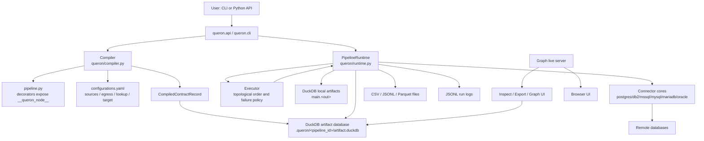
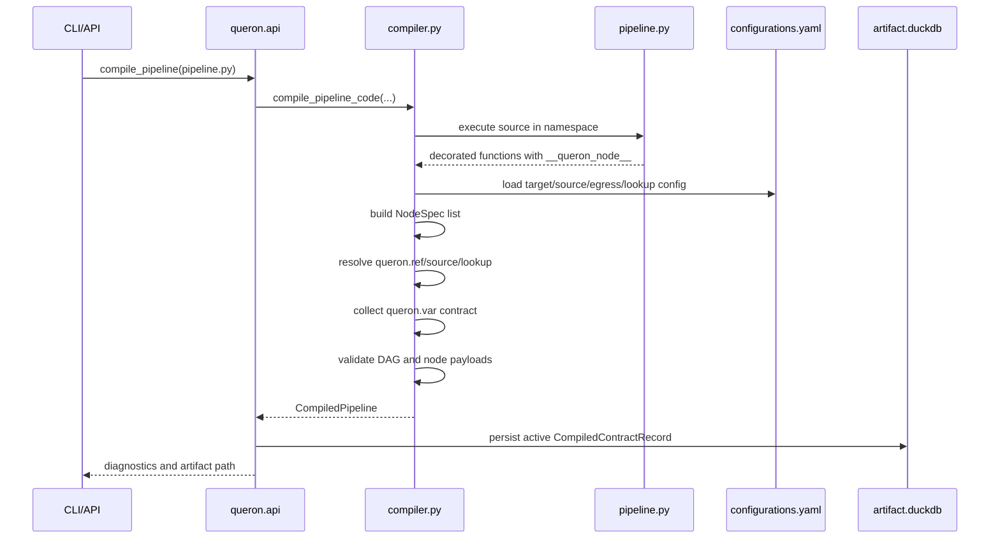
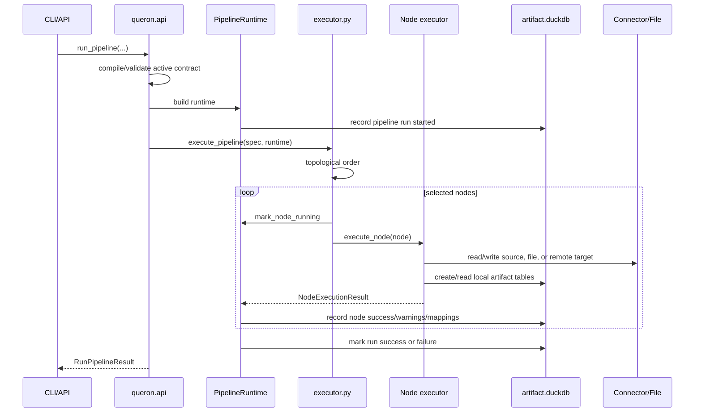
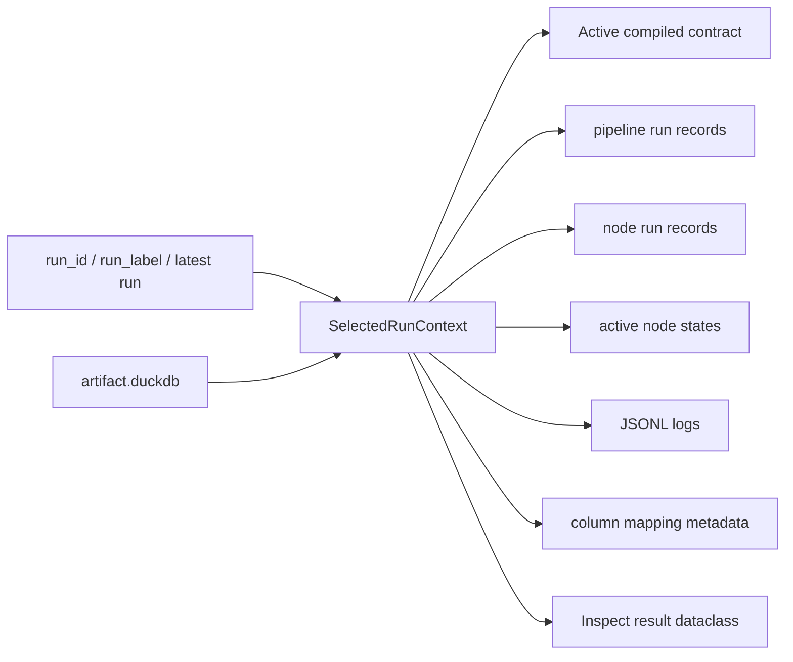

# Internals Guide

This guide explains what happens under the hood when Queron compiles, runs, retains artifacts, and serves inspection data.

## Architecture Diagram



## Compile: Detailed Flow

Compile is the metadata and validation phase. It does not execute pipeline nodes.



### 1. Pipeline Code Loading

The API reads `pipeline.py` and compiles it as Python source. The module is executed in a namespace. Decorators from `queron/__init__.py` attach a `__queron_node__` dictionary to each decorated function.

Example metadata shape:

```python
{
    "kind": "model.sql",
    "function_name": "customer_summary",
    "name": "customer_summary",
    "out": "customer_summary",
    "query": "...",
}
```

### 2. NodeSpec Construction

The compiler converts decorator payloads into `NodeSpec` objects. A node spec contains:

- `name`: unique node name
- `function_name`: Python function name
- `kind`: runtime node kind
- `sql` or `query`
- `out`: logical artifact name
- `target_table`: resolved local DuckDB table for materialized outputs
- `config`: database connection binding name
- `target_relation`: remote egress or lookup table
- `dependencies`: final dependency list
- `auto_dependencies`: dependencies inferred from refs/lookups
- `manual_dependencies`: dependencies from `depends_on`
- `resolved_sql`: SQL with ref/source/lookup placeholders resolved
- `metadata`: runtime vars and compiler metadata

### 3. Config Resolution

`configurations.yaml` controls logical-to-physical relation resolution.

Compile chooses the target in this order:

1. API/CLI explicit target
2. `QUERON_TARGET`
3. `target:` from `configurations.yaml`

For `queron.source("pg_policy")`, the compiler looks under:

```yaml
sources:
  pg_policy:
    dev:
      schema: public
      table: policy
```

It renders the physical relation with quoted identifiers, for example:

```sql
"public"."policy"
```

`queron.source(...)` is optional for stable external source tables in database ingress SQL. If the table does not change by target, ingress SQL can reference the physical relation directly, for example `public.policy`. Raw external relations are not allowed in model SQL, check SQL, or other internal query surfaces.

### 4. Dependency Resolution

The compiler scans SQL for:

- `{{ queron.ref("name") }}`
- `{{ queron.source("name") }}`
- `{{ queron.lookup("name") }}`
- `{{ queron.var("name") }}`

`queron.ref(...)` creates a dependency on the node that produced the referenced `out`.

`queron.ref(...)` is mandatory for Queron-managed artifacts. Raw references to local artifact tables are rejected so dependency tracking and run-scoped artifact resolution stay explicit.

`depends_on` creates a manual dependency even if SQL has no ref.

Final dependencies are:

```text
auto_dependencies + manual_dependencies
```

Duplicates are removed while preserving order.

### 5. SQL Rendering

At compile time:

- `queron.ref(...)` becomes the local DuckDB artifact table, usually `"main"."<out>"`.
- `queron.source(...)` becomes the configured remote source relation. Stable raw external table names in database ingress SQL pass through unchanged.
- `queron.lookup(...)` becomes the configured remote lookup relation.
- `queron.var(...)` remains a runtime placeholder and is validated separately.

### 6. Runtime Variable Contract

The compiler records every `queron.var(...)` use into the contract.

For each variable it stores:

- `name`
- `kind`: `scalar` or `list`
- `required`
- `default`
- `log_value`
- `mutable_after_start`
- `used_in_nodes`

Runtime vars are only valid in SQL value positions. The compiler rejects vars in table names, column names, `FROM`, `JOIN`, `ORDER BY`, and similar structural SQL positions.

### 7. Validation

Compile diagnostics include:

| Diagnostic area | Examples |
|---|---|
| Node identity | duplicate node names, duplicate outputs |
| References | unknown refs, raw direct table references |
| Config | missing `config`, missing source/egress/lookup relation |
| File nodes | missing path, invalid delimiter, unsupported format |
| Egress | missing target relation, invalid mode |
| Runtime vars | invalid placement, unknown options, conflicting var kind |
| DAG | self-dependency, unknown dependency, cycles |
| Imports | project imports that resolve outside project root |

Compile can return a `CompiledPipeline` with diagnostics even when errors exist. `has_compile_errors(compiled)` checks whether execution should proceed.

### 8. Contract Persistence

The active compile contract is stored in the artifact DuckDB database. It includes:

- `compile_id`
- `pipeline_id`
- `pipeline_path`
- `project_root`
- `artifact_path`
- `target`
- hashes of contract/config/project files
- tracked files
- external dependencies
- runtime var contract
- full spec JSON
- diagnostics

The contract lets run/resume/inspect verify what pipeline version produced the artifact metadata.

## Run: Detailed Flow

Run executes the compiled DAG.



### 1. Runtime Creation

`run_pipeline(...)` builds `PipelineRuntime` with:

- `pipeline_id`
- `compile_id`
- artifact DuckDB path
- project working directory
- compiled `PipelineSpec`
- module globals from the pipeline
- runtime bindings
- runtime vars
- connections config
- log callback
- run policy

The runtime generates:

- `run_id`
- `log_path`
- active stop request path

### 2. Connection Resolution

Database nodes use a `config` name. Runtime resolves it from:

1. `runtime_bindings` passed to `run_pipeline`
2. `connections.yaml` from explicit path
3. `QUERON_CONNECTIONS_FILE`
4. `./connections.yaml`

Runtime binding objects and mapping payloads normalize into connector-specific request payloads.

### 3. Runtime Var Validation

Before execution, runtime vars are checked against the compiled contract:

- unknown vars are rejected
- missing required vars are rejected
- list vars must be non-empty lists or tuples
- scalar vars cannot be lists
- defaults are applied

At SQL execution time, vars are replaced with driver-specific placeholders:

| Driver/context | Placeholder style |
|---|---|
| DuckDB, DB2, MSSQL, MySQL, MariaDB | `?` |
| PostgreSQL | `%s` |
| Oracle | `:1`, `:2`, ... |

Values are passed as parameters, not interpolated into SQL text.

### 4. Node Selection

Default run selects every node.

`target_node` selects:

- the target node
- all upstream dependencies needed by that node

Execution order is topological. Ready check nodes run before other ready nodes at the same dependency level.

### 5. Node Execution by Kind

| Node kind | Runtime behavior |
|---|---|
| `model.sql` | Executes DuckDB SQL and materializes `main.<out>`. |
| `python.ingress` | Calls Python function, ingests returned data into DuckDB. |
| `csv/jsonl/parquet.ingress` | Reads local file into DuckDB. |
| database `.ingress` | Runs source SQL on remote database and writes result into DuckDB. |
| database `.lookup` | Writes DuckDB query result into a remote lookup table. |
| database `.egress` | Writes DuckDB query result into a remote target table. |
| file `.egress` | Exports DuckDB query result to file. |
| `check.count` | Fails if numeric comparison is true. |
| `check.boolean` | Fails if boolean result is true. |

### 6. Run and Node Records

The runtime records:

- pipeline run start/end/status
- node run start/end/status
- active node state
- row counts
- artifact table names
- warnings
- error details
- column mappings
- log path
- runtime var values

Node statuses include:

- `ready`
- `running`
- `complete`
- `complete_with_warnings`
- `failed`
- `skipped`
- `cleared`

Run statuses include:

- `pending`
- `running`
- `success`
- `success_with_warnings`
- `failed`
- `skipped`

### 7. Failure Handling

Default policy:

- `on_exception = stop`
- `on_warning = continue`
- `persist_node_outcomes = true`
- `downstream_on_hard_failure = skip`

When a node fails:

1. current node is marked failed
2. remaining selected nodes are marked skipped
3. run is marked failed
4. exception is raised to the caller

## Artifact Retention

Queron uses DuckDB as the local artifact store.

Default path:

```text
.queron/<pipeline_id>/artifact.duckdb
```

Related directories:

```text
.queron/<pipeline_id>/logs/
.queron/<pipeline_id>/exports/
.queron/<pipeline_id>/stop_requests/
```

## Active Artifacts

Materialized node outputs are written as DuckDB tables, usually:

```text
main.<out>
```

Examples:

```text
main.policy_core
main.customer_profile
main.policy_servicing_queue
```

These active tables represent the current workspace state for the pipeline.

## Archived Run Artifacts

Successful runs can archive local DuckDB artifact tables per run. Inspection can then read either:

- active artifact database
- archived artifact database for the selected run

The selected run context tracks:

- `artifact_path`
- `archived_artifact_path`
- `is_final`
- per-node `artifact_name`
- per-node `archived_artifact_name`

This is why inspection results include both active and archived artifact fields.

## Final Runs

A run can be marked final. Finality matters for inspection and retention because finalized failed runs become immutable historical records instead of active resume candidates.

`--set-final` finalizes the latest failed or stale running run before starting a new run.

## Clean Existing Outputs

`clean_existing=True` or `--clean-existing` drops existing output tables before running. Use this when an existing artifact table conflicts with the run you want to produce.

Without clean mode, Queron protects existing outputs and can require explicit cleanup.

## Reset Behavior

Reset drops output tables and records cleared state.

| Reset API | Effect |
|---|---|
| `reset_node` | Clears one node output. |
| `reset_upstream` | Clears selected node plus upstream dependencies. |
| `reset_downstream` | Clears selected node plus downstream dependents. |
| `reset_all` | Clears all materialized outputs. |

Reset uses the compiled DAG to select tables. It is intended for failed runs before resume.

## Lookup Table Retention

Database lookup nodes write remote lookup tables. The `retain` option controls whether a lookup table should remain after use when the connector supports it.

| Connector | Lookup `retain` exposed |
|---|---|
| PostgreSQL | yes |
| DB2 | no |
| MSSQL | no |
| MySQL | yes |
| MariaDB | yes |
| Oracle | yes |

Non-retained lookup tables are registered for cleanup.

## Inspect: Detailed Flow

Inspect functions are read-only. They reconstruct a run/node view from the artifact database and archived artifact metadata.



## Run Selection

Most inspect APIs accept:

- `run_id`
- `run_label`

If neither is supplied, Queron selects the latest run for the pipeline where the calling path allows that default.

If a selected run has an archived artifact database, inspect uses it for artifact data and active metadata DB for run metadata.

## `inspect_dag(...)`

`inspect_dag` returns the full graph view:

- pipeline path
- artifact path
- compile/run IDs
- run label and status
- whether selected run is final
- runtime var contract
- nodes
- edges
- dependency edges

Each node payload can include:

- `name`
- `kind`
- current state
- logical artifact
- physical artifact table
- row counts
- warnings
- error message
- lookup table
- dependencies and dependents
- column mappings

## `inspect_node(...)`

`inspect_node` returns one of three views:

- one node
- requested node plus upstream dependencies
- requested node plus downstream dependents

It uses the compiled DAG edges and the selected run state.

Use cases:

- debug why a node did not run
- see dependencies for a node
- find downstream blast radius before reset
- inspect artifact and lookup metadata

## `inspect_node_history(...)`

Returns the timeline of state transitions for one node in one run.

Typical states:

```text
ready -> running -> complete
ready -> running -> failed
cleared
skipped
```

Use it to answer "what happened to this node during this run?"

## `inspect_node_logs(...)`

Reads persisted JSONL logs for the selected run and filters them to a node.

Use `tail` to limit returned events.

## `inspect_node_query(...)`

Returns:

- original SQL
- resolved SQL
- runtime dependencies
- logical artifact
- physical artifact
- effective artifact path

Use it to debug template expansion. It shows what `queron.ref(...)`, `queron.source(...)`, and `queron.lookup(...)` became after compile. Raw external table names used in database ingress SQL remain visible as written.

## `export_artifact(...)`

Export reads a materialized DuckDB artifact table and writes it as:

- CSV
- Parquet
- JSON

Selection can be by:

- `node_name`
- physical `artifact_name`, for example `main.policy_core`

When no output path is supplied, Queron writes under:

```text
.queron/<pipeline_id>/exports/<run_id>/
```

## Common Debugging Workflow

1. Compile with JSON output.

```bash
queron compile pipeline.py --json
```

2. Run with streamed logs.

```bash
queron run pipeline.py --stream-logs
```

3. List runs.

```bash
queron inspect_runs
```

4. Inspect the DAG.

```bash
queron inspect_dag --run-id <run_id>
```

5. Inspect failed node.

```bash
queron inspect_node <node_name> --run-id <run_id>
queron inspect_node_query <node_name> --run-id <run_id>
queron inspect_node_logs <node_name> --run-id <run_id> --tail 100
```

6. Reset and resume if appropriate.

```bash
queron reset-downstream pipeline.py <node_name>
queron resume pipeline.py --stream-logs
```
